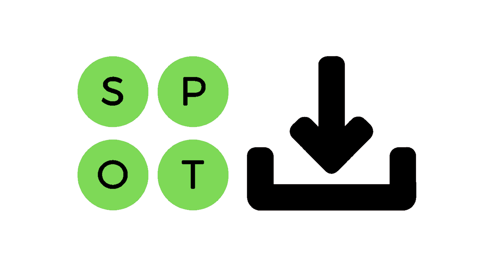

# spotDL

> The fastest, easiest, and most accurate command-line music downloader

[](https://github.com/spotDL/spotify-downloader/blob/master/LICENSE)


[](https://bettercodehub.com/)
[](https://pypi.org/project/spotdl/)
[](https://pypi.org/project/spotdl/)
[](https://pypi.org/project/spotdl/)
[](https://discord.gg/xCa23pwJWY)

What spotDL does:

1. Downloads music from YouTube as an MP3 file
2. Applies basic metadata gathered from Spotify such as:
   - Track Name
   - Track Number
   - Album
   - Album Cover
   - Genre
   - and more!

### Announcing spotDL v3

We rebuilt spotDL from scratch to be faster, simpler, and better than spotDL v2. Documentation is still a work in progress.

⚠ We have dropped the active development of spotDL v2 due to support and maintainability. No focused efforts will be made to resolve v2 specific issues.

### Join the [spotDL Discord!](https://discord.gg/xCa23pwJWY)!


## Installation

You need to download FFmpeg to use this tool. Download and installation instructions can be found at [FFmpeg.org](https://ffmpeg.org/)

### Installing spotDL

- Recommended Stable Version:

  ```
  $ pip install spotdl
  ```

- Install directly from master: (Use if experiencing issues)

  ```
  $ pip install https://codeload.github.com/spotDL/spotify-downloader/zip/master
  ```

- Dev Version: __(NOT STABLE)__

  ```
  $ pip install https://codeload.github.com/spotDL/spotify-downloader/zip/dev
  ```

___YouTube Music must be available in your country for spotDL to work. This is because we use YouTube Music to filter search results. You can check if YouTube Music is available in your country, by visiting [YouTube Music](https://music.youtube.com).___

## Usage (Instructions for v3)

- To download a song, run:

  ```
  $ spotdl [trackUrl]
  ```

  ex. `spotdl https://open.spotify.com/track/0VjIjW4GlUZAMYd2vXMi3b?si=1stnMF5GSdClnIEARnJiiQ`


- To download an album, run:

  ```
  $ spotdl [albumUrl]
  ```

  ex. `spotdl https://open.spotify.com/album/4yP0hdKOZPNshxUOjY0cZj?si=AssgQQrVTJqptFe7X92jNg`


- To download a playlist, run:

  ```
  $ spotdl [playlistUrl]
  ```

  ex. `spotdl https://open.spotify.com/playlist/37i9dQZF1E8UXBoz02kGID?si=oGd5ctlyQ0qblj_bL6WWow`


- To search for and download a song, run, __with quotation marks__:  
  _Note: This is not accurate and often causes errors._

  ```
  $ spotdl '[songQuery]'
  ```

  ex. `spotdl 'The Weeknd - Blinding Lights'`


- To resume a failed/incomplete download, run:

  ```
  $ spotdl [pathToTrackingFile]
  ```

  ex. `spotdl 'The Weeknd - Blinding Lights.spotdlTrackingFile'`

  _`.spotdlTrackingFile`s are automatically created when a download starts and deleted on completion_


You can queue up multiple download tasks by separating the arguments with spaces:

```
$ spotdl [songQuery1] [albumUrl] [songQuery2] ... (order does not matter)
```

ex. `spotdl 'The Weeknd - Blinding Lights' https://open.spotify.com/playlist/37i9dQZF1E8UXBoz02kGID?si=oGd5ctlyQ0qblj_bL6WWow ...`


_spotDL downloads up to 4 songs in parallel, so for a faster experience, download albums and playlist, rather than tracks._

## `pipx` Isolated Environment Alternative

For users who are not familiar with `pipx`, it can be used to run scripts __without__ installing the spotDL package and all the dependencies globally with pip. (Effectively skipping over the [Installation](https://github.com/spotDL/spotify-downloader#Installation) step)

First, you will need to install `pipx` by running:

```
python3 -m pip install --user pipx
python3 -m pipx ensurepath
```

Next, you can jump directly to running spotDL with:

```
pipx run spotdl ...
```

## For Developers and Contributors

1. Clone this repository
   ```
   $ git clone https://github.com/spotDL/spotify-downloader.git
   $ cd spotify-downloader
   ```
2. Setup venv (Optional)
   - Windows
     ```
     $ py -3 -m venv env
     $ .\.venv\Scripts\activate
     ```
   - Linux/macOS
     ```
     $ python3 -m venv .venv
     $ source .venv/bin/activate
     ```
3. Install requirements
   ```
   $ pip install -e .
   ```

- Use as command (no need to re-install after file changes)
  ```
  $ spotdl [ARGUMENTS]
  ```

## Thank Yous

1. [@ritiek](https://github.com/ritiek) for creating and maintaining spotDL for 4 years
2. [@rocketinventor](https://github.com/rocketinventor) for figuring out YouTube Music querying
3. [@Mikhail-Zex](https://github.com/Mikhail-Zex) for, never mind...
